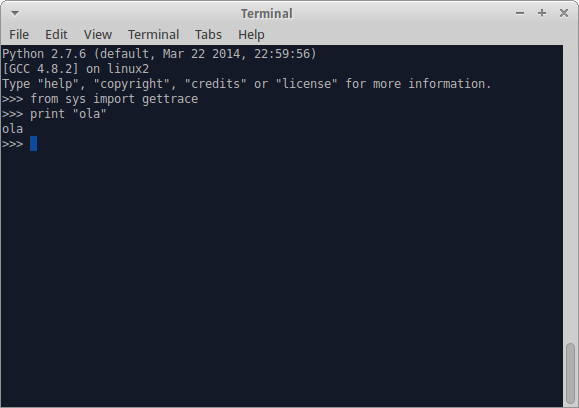
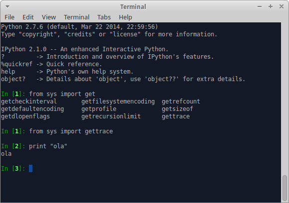
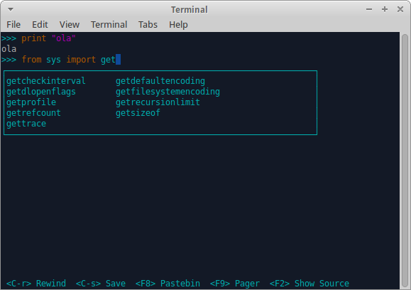
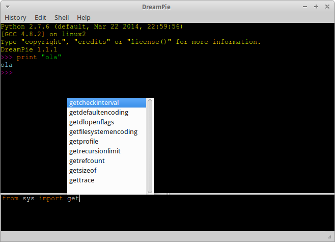
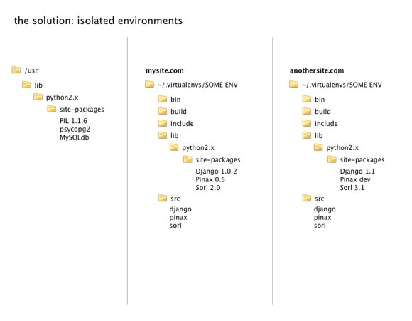

# Python 2.7.x Dojo

Build a small system (two software pieces) that will show on a browser the most 5 recent videos from YouTube, and by doing this, learn all through the Python basic concepts.

## Chapter 1 - Basics

### Concepts to understand

- Pip & http://pypi.python.org
  - Pip used to upgrade itself?
  - Pip install libs or software? Or both?
  - What is the difference between a lib and a software?
- Line prompt coding, bpython, ipython, dreampie, and so on...

 
 
 
 

- Indentation is everything
- Use vi and code like a boss
- How to run a Python 2.7 script
- Virtualenv, Virtualenv, and ... Virtualenv

 
  - Installing
  - Activating
  - Automation?
- Code in UTF-8 ... ALWAYS!

    # -*- encoding: utf-8 -*-

## Chapter 2 - Hands on - part I

### To do

- Use Flask
- Debugging on browser (yep, your code needs to fail)
- "/show" must be the entry point
- Must output any string, like a "hello world"

## Chapter 3 - Hands on - part II

### To do

- Use Python Requests
- FEED: https://gdata.youtube.com/feeds/api/videos?q=a&max-results=5&v=2&alt=jsonc&orderby=published
- Must download and persist the json data on /tmp
- System cron must be used

## Chapter 4 - Hands on - part III

### To do

- Use Jinja2 (for templates)
- "/show" must be the entry point
- Must read the json data on /tmp
- Must list on the browser the 5 videos, including thumb and metadata

## Chapter 5 - Is it clear to read?

### Concepts

- Tabs x Spaces
- PEP8
- Pylint
- How to print your software version?

### To do

- Make your code clear to be read by others

## Chapter 6 - Packaging

### Concepts

- How can I pack my software?
- Egg Package structure
- The awesome Machete tool

### To do

- Code everything again, using Machete templates

## Chapter 7 - Testing

- Nose

## Chapter 8 - Final Concepts

- Egg x Wheel
- pip install (Install from everywhere)
- virtualenvwrapper
- cron: to use or not?
- filtros jinja
- decorators
- Upload my software to Pypi
- Boilerplates & Bootstrap (shortcuts)
- flask-bootstrap
- Python is not Java ... forget getters and setters (http://typicalprogrammer.com/doing-it-wrong-getters-and-setters/)

## Chapter 9 - To space and beyond

- http://www.rafekettler.com/magicmethods.pdf
